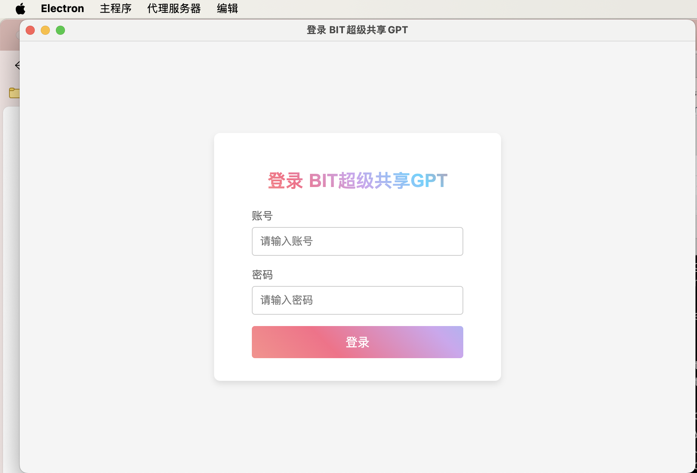
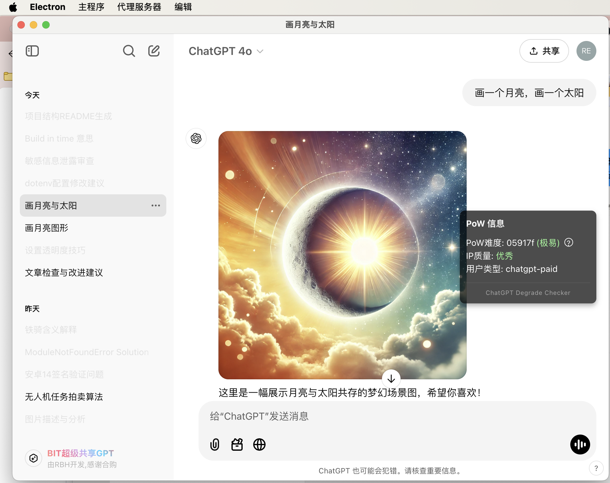
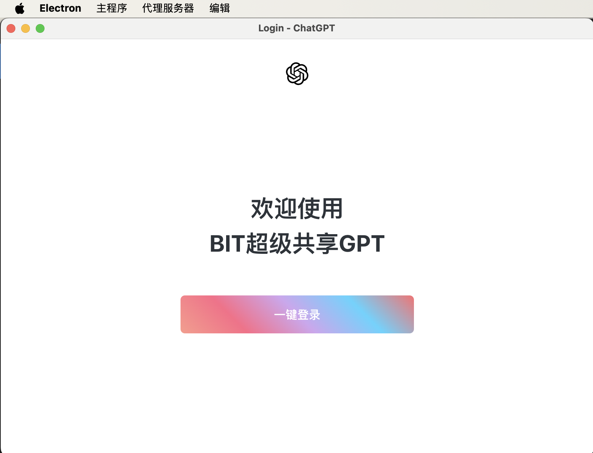
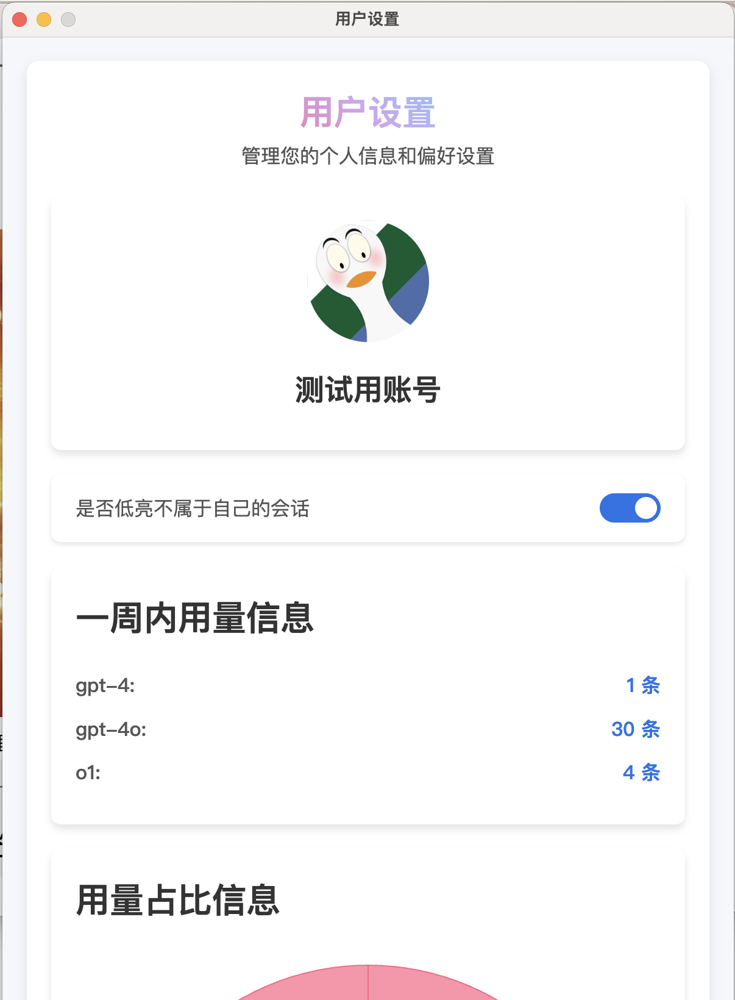

# BIT超级共享GPT

一个能够在本地共享Plus账号，避免OpenAI标记降智前提下，使用原生网页版ChatGPT Plus的项目

[](https://star-history.com/#BobH233/BITSuperGPT-client&Date)

## 截图预览

|  |
|:--:|
| _登录界面_ |

|  |
|:--:|
| _原生ChatGPT界面_ |

|  |
|:--:|
| _一键登录界面_ |

|  |
|:--:|
| _用量统计界面_ |

## 什么原理？

这个项目一句话概括，是：一个自带可配置代理服务器的，指定代理服务器只能访问ChatGPT的，代理服务器终端IP是绿色稳定未被OpenAI封禁的，注入了一些自定义js脚本的本地特制浏览器。

## 什么功能？

多人共享使用同一个ChatGPT Plus账号，并且无需担心因为多人使用而造成OpenAI检测导致的ChatGPT降低智力问题。

支持每个人单独用自己的账号密码（指的是BIT超级共享GPT的账号密码）登录，支持使用客户端“无密码（指的是不需要输入ChatGPT的登录密码）一键登录ChatGPT”。

支持统计每个人的模型用量信息，详细到模型名称，调用时间（暂时没有编写查看这些统计用量的可视化后台界面，不过这些数据已经记录到了后台数据库，之后我应该会完善的）。

## 适用人群？

适合一个学校的几个需要使用ChatGPT的同学一起合购一个账户，然后共享使用。（因为如果直接共享ChatGPT的账号密码，各个同学使用的登录ip必然各不相同，容易造成OpenAI检测到劣质IP地址，或者检测到多人共享登录而处罚这个账号降智）

📢请注意，本项目并不适合于盈利，我们也不倡导用本项目来共享账号盈利，因为本项目的目标人群就是自己认识的同学或者家人，所以我在写代码的时候并没有对代码层面做过多的防护（包括asar加密等等），尽管各个账号登录ChatGPT的时候并看不到实际的ChatGPT的账号密码，但是防君子不防小人，最终的ChatGPT账号本体密码一定是在其他人的本地以明文形式登录的，因此要想别人完全拿不到你的ChatGPT账号本体密码，是完全不可能的。因此建议不要用于盈利目的，只给自己信任的人使用！

## 搭建需要什么条件？

你需要有一个ChatGPT网页版账号，这个账号你需要充值Plus账号（因为你要共享给别人使用Plus）

你需要一个能够访问ChatGPT的绿色ip，这个ip可能来自搬瓦工，也可能来自其他能访问ChatGPT国家的家庭宽带，请确保这个ip不在OpenAI的不信任列表里面（比如大机场，或者很多人共享的劣质IP地址）。至于怎么购买这样的服务器，以及怎么搭建sing-box代理，不在本项目的讨论范围，请自行google解决。

你需要有基本的开发知识，比如nodejs后端项目的运行部署相关知识，比如linux基底服务器的运维基础知识等等，我不会在README里面过多阐述，默认你已经知道。如果你需要手把手的搭建服务，这大概率是需要有偿的。

# 构建和开发

## 项目结构

```
BITSUPERGPT-CLIENT/
├── dist/                 # （编译后的文件目录）
├── node_modules/         # （依赖库文件夹）
├── resources/            # （资源文件，注入的js文件，内置的网页等）
├── sing-box/             # （代理服务器二进制文件，目前仅支持windows和macos）
├── webpacked/            # （程序代码打包混淆后的文件目录）
├── .gitignore            # Git 忽略文件配置
├── main.js               # 主入口文件，负责程序启动
├── package.json          # 项目的 npm 配置文件，包含依赖和脚本
├── preload.js            # 预加载脚本，用于electron暴露API接口
├── README.md             # 项目说明文档
├── web_api.js            # 与后端交互部分代码
└── webpack.config.js     # Webpack 配置文件，用于打包项目
```

## 安装项目依赖

需要nodejs，我的开发环境nodejs版本是v23.4.0

我安装了cnpm来加速安装依赖，用以下指令安装依赖

```bash
cnpm install
```

你也可以使用其他包管理器，比如 npm 或者 yarn

## 配置项目

在项目根目录新建 `.env` 文件，并根据以下模板来填写信息

```
API_BASE_URL=<你搭建的后端服务器http(s)地址(例: https://mydomain.com/api)>

ENCRYPTION_KEY=<你在后端配置的加密密匙，注意必须是32位长度字符串>

# 是否启用自动检查更新服务（用的是electron-updater,不懂就填false）
ENABLE_UPDATE_SERVER=true

# macos自动更新服务接口（用的是electron-updater,不懂就填false）
UPDATE_SERVER_URL_macos=http://example.com/updates/mac/

# windows自动更新服务接口（用的是electron-updater,不懂就填false）
UPDATE_SERVER_URL_windows=http://example.com/updates/win/
```

然后参考 `sing-box/config.demo.json`，编写 `sing-box/config.json`，在里面的 `outbounds`一栏，根据你自己搭建的拥有绿色IP的服务器上sing-box的配置情况而定，至于怎么配置sing-box，请参考google上官方文档，在这里不可以赘述过多。

## 运行项目

完成了以上配置后，启动你的后端接口程序，你就已经可以开始运行并体验效果了，输入以下指令开始运行：

```bash
npm start
```

使用这种指令调试运行会自动打开控制台窗口，你可以手动关闭，在构建后的程序里面不会弹出控制台窗口

如果登录正常，并且能够正常打开openai官网，说明你的客户端配置成功了，有关后端服务器的更多配置以及解释，请你参考对应的[后端项目](https://github.com/BobH233/BITSuperGPT-server)。

## 构建项目

目前该项目仅适配了macos端以及windows端，预计后期会适配linux端，因此目前仅支持构建macos端的应用程序以及windows端的应用程序。

输入以下指令构建windows端的安装包以及绿色安装版本：

```bash
npm run build:win
```

生成的windows安装包以及目录解压版本会在 `dist`文件夹里面

如遇到构建报错，请参考electron的各种报错问题，自行在google上搜索，或者在该项目提出issue求助

输入以下指令构建macos端的安装包以及绿色安装版本（建议构建macos时在macos环境，不要在windows环境）：

```bash
npm run build:mac
```

生成的macos的dmg安装包以及zip版本会在 `dist`文件夹里面

请注意，macos的版本默认不会构建时签名，如需要本机签名，请移除`package.json`里面，`mac`属性的`"identity": null`这一项，即可使用本机macos的签名文件进行签名。

# 特别感谢

感谢**何同学**警醒我在引用别人的包的时候，要记得在README注明出处

本项目引用的 `resources/injections/chatgpt_detection.js` 源代码用于监控ChatGPT的ip质量，来源于油猴脚本：[ChatGPT降智风险检测✅（优化版）](https://greasyfork.org/zh-CN/scripts/517439-chatgpt%E9%99%8D%E6%99%BA%E9%A3%8E%E9%99%A9%E6%A3%80%E6%B5%8B-%E4%BC%98%E5%8C%96%E7%89%88)

特别感谢ChatGPT给我写出了能够共享使用ChatGPT的代码
